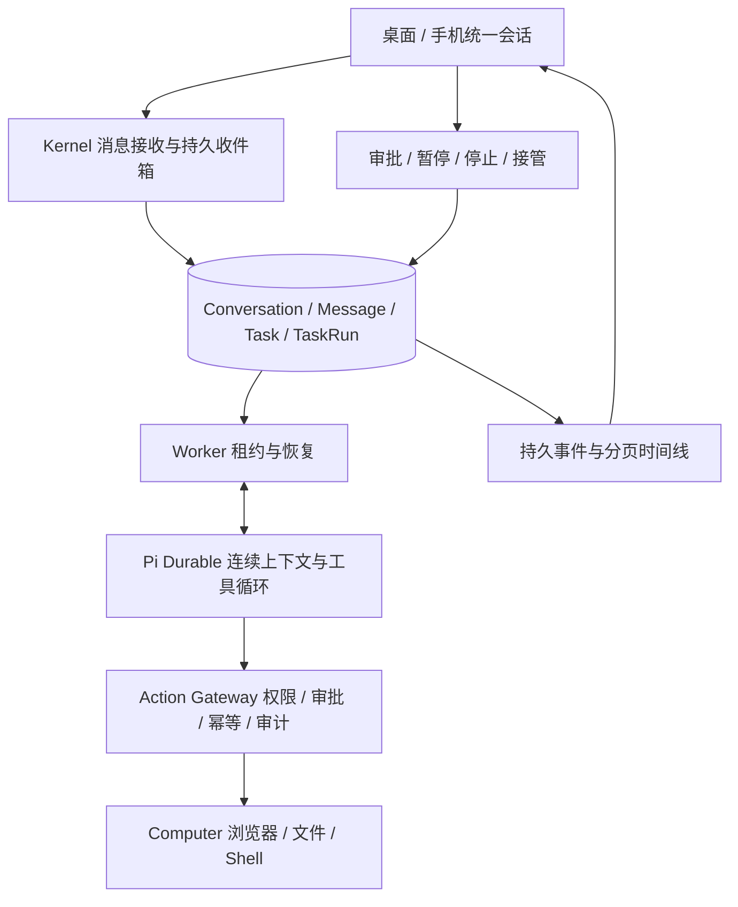

# 统一会话与执行架构

用户在一个长期会话内讨论、执行、补充要求、审批和接管电脑。Chat 不再直接调用无工具模型，也不再需要手动转为任务。

## 三层职责与生命周期

- Kernel 管理长期会话、消息接收、执行状态、Worker 租约和控制边界；Pi 决定回答、调用工具、修改计划或等待人工。
- `Conversation` 是长期上下文，绑定 Agent 和可选电脑。`Task` 是会话内一次逻辑执行；`TaskRun` 是该执行的一次 Worker 租约。失败保留当前执行，重试只换租约。
- 纯聊天也启动一次执行，但无需先生成计划；回答即可结束。完成或取消后，下一条消息启动新的执行，仍共享会话和 Pi 历史。
- 同会话最多一个未结束执行，FAILED 也占用当前执行。暂停、失败、等待人工时，消息只保存；恢复、重试、审批及交还电脑仍使用明确的控制入口。
- 新会话执行固定使用 Pi。既有任务保留原运行时和按 Task ID 定位的会话卷；新会话按 Conversation ID 定位。会话身份、执行电脑与模型进程分别存储。

## API 与消息可靠性

| 接口 | 行为 |
| --- | --- |
| `POST /api/conversations` | 创建会话；接受 title、agent_id、computer_id |
| `GET /api/conversations` | 最近会话，按更新时间排序 |
| `POST /api/conversations/{id}/messages` | 接受 content、可选 client_id，返回 HTTP 202 和 conversation、messages、task、accepted |
| `GET /api/conversations/{id}/messages` | 最近消息，按会话序号排列；长历史使用 timeline |
| `GET /api/conversations/{id}/timeline?after=0&limit=100` | 返回 items、next_cursor、has_more、tasks、artifacts；items 使用持久 Event ID 去重 |
| `POST /api/chat` | 兼容异步发送入口，可指定 conversation_id、computer_id、client_id；不等待模型，不返回占位 assistant |
| `POST /api/tasks` | 兼容创建执行，同时建立会话及首条用户消息 |

任务查询、暂停、恢复、重试、停止、绑定电脑、审批和 UNKNOWN 核实接口继续使用原契约。旧客户端必须更新 `/api/chat` 的同步响应假设。

Kernel 先将消息落库，再由 Worker 通过 stdio 投递 Pi。消息 ID 是 Pi `requestId`；只有 Pi 持久接收后才写入 delivered_at 和 submission_id。运行中使用 `whenBusy: steer`，在当前工具轮次之后生效。数据库接收确认与 Pi JSONL 没有分布式事务，依靠稳定 requestId 重投去重；重启也恢复已确认但尚未完成的 steering submission。

会话锁序为 Conversation → Task → Computer → Action/Approval；SQLite 用会话行 UPDATE 序列化写入，PostgreSQL 同时使用行锁和部分唯一索引。消息序号和 client_id 在会话内唯一。完成事务若发现仍有未投递消息，将原执行保持为 PENDING，防止完成瞬间收到的消息滞留。

收到补充要求后，尚未执行的提案和待审批动作变为 DENIED；已执行动作不撤销，UNKNOWN 仍需人工核实。模型请求期间目标发生变化时，旧响应中的动作被拒绝。取消后启动下一轮前，Pi 撤销旧轮次的未完成工作，避免旧工具被归属到新执行。

## 迁移与部署顺序

新增迁移 `a7c21010d001`。它保留原 Chat 历史，将遗留 PENDING 回复标记为 INTERRUPTED；每个原任务独立补建会话，保留任务 ID、checkpoint、动作、审批和产物。没有关联证据的聊天与任务不配对。

先同时备份 PostgreSQL 和 pi_sessions，再停止旧 Worker，升级数据库与 API/Worker，部署新客户端后启动 Worker。不要让旧版 API/Worker 写入新版数据库。迁移回退需恢复对应数据库与 Pi 卷备份，downgrade 不删除已接收消息。

本轮没有增加多 Bot、Routine、多屏幕或多机 Worker。仍使用单个 Linux Worker、现有共享电脑租约和原审批策略。验证与限制见 [本轮验收记录](unified-conversations-validation-20261010.md)。
